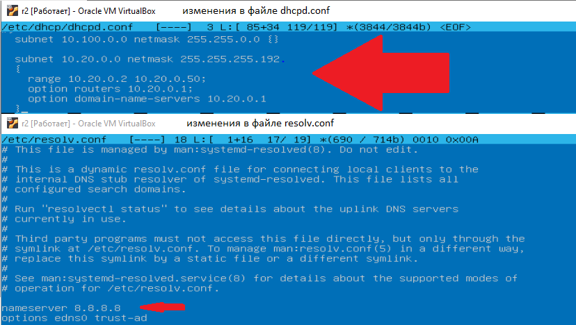
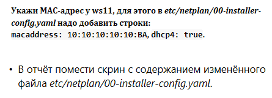
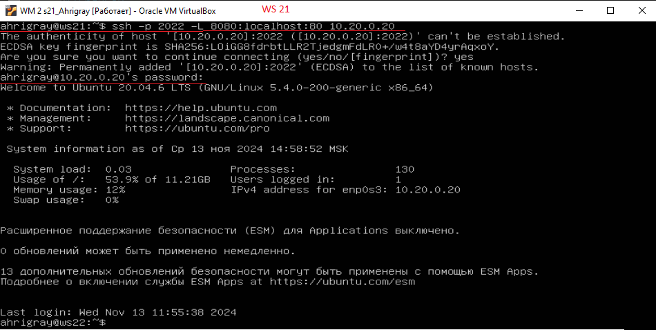
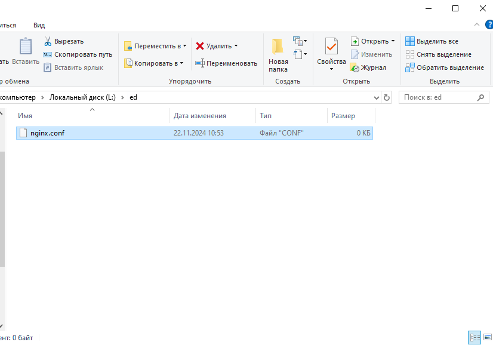
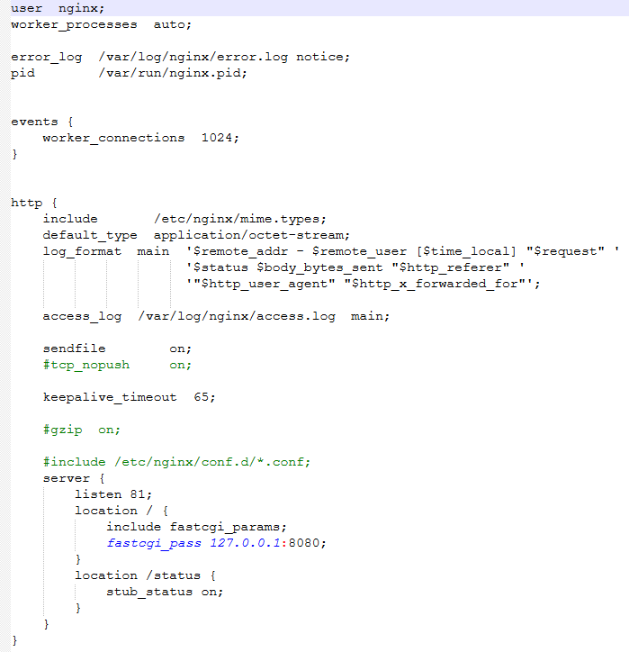
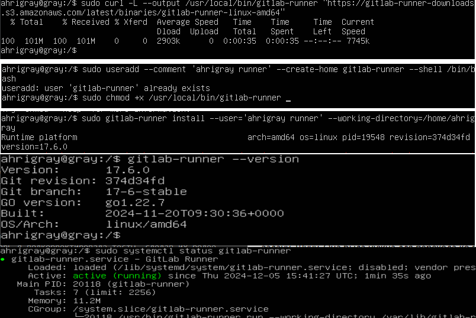
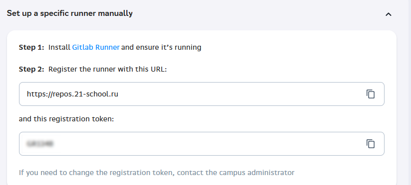
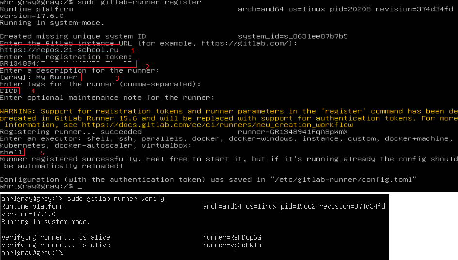
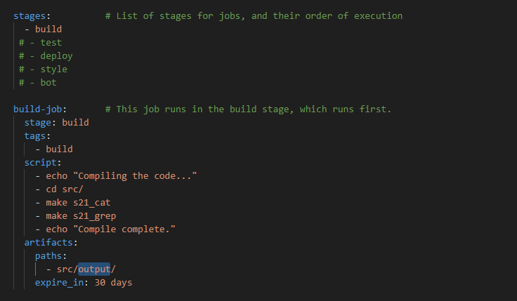
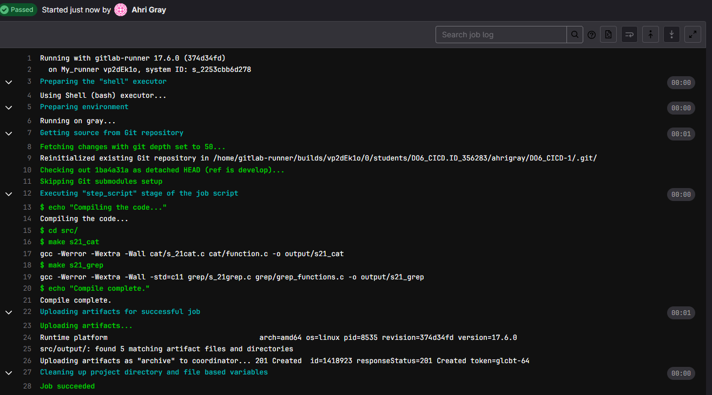

# Навигация
[Перейти к Linux](#linux)  
[Перейти к LinuxNetwork](#linuxnetwork)  
[Перейти к Docker](#docker)  
[Перейти к CI/CD](#ci-cd)


# Linux
## Задание 1. Установка ОС
> Установленная версия UBUNTU Server 20.04


## Задание 2. Создание пользователя
<image src="materials\example_01\EX_2.0.png" alt="Рис. 2">

> Команда создания пользователя с ником admin, с ключом G для включение его в группу 
  пользователей adm
  

> Результат выполнения комманды. А также вывод команды getent group adm - выводящая список
>пользователей входящих в группу adm
>

> Вывод команды cat /etc/passwd. /etc/passwd, содержит информацию о учетных записях пользователей. Каждая строка в этом файле представляет собой учетную запись пользователя и включает такие данные, как имя пользователя, идентификатор пользователя (UID), идентификатор группы (GID), домашний каталог и оболочку по умолчанию.

## Задание 3. Настройка сети ОС 
### Меняем имя ХОСТА 3.1


> Старое назавние хоста


> Командой hostname запущеной от имени администратора меняем имя машины на user-1. После чего вводим
>снова комманду hostname убиждаясь что имя хоста изменено.

Чтобы имя сервера было осталось user-1 после перезагрузки не обходимо отредактировать файл hostname а также hosts

## Устанавливаем временную зону.


> Time zone до внесения изменений


> с помощью команды `timedatectl list-timezone` узнаем доступные временные зоны


> с помощю команды `timedatectl set-timezone Europe/Moscow` устанавливаем временную зону 

Выведем названия сетевых интерфейсов с помощью команды `ip link show` или `ip address` а также `ls /sys/class/net`

> 1: lo - Это  интерфейс "loopback", который используется для связи с самим собой.

> 2: enp0s3: - это имя Ethernet-интерфейса
>  - где en казывает, что это Ethernet-интерфейс. 
>  - p0 указывает на номер шины (bus number).
>  - s3 указывает на номер слота (slot number).

Выводы команд `ip address` и `ls/sys/class/net`

>Команда `ls/sys/class/net` выводит список всех сетевых интерфейсов, доступных на устройстве. Каждый интерфейс представлен в виде каталог, в данном случае их два enp0s3 и lo.
### Об интерфейсе lo
Интерфейс lo, также известный как loopback интерфейс, является специальным сетевым интерфейсом в операционных системах, включая Linux. 
Назначение интерфейса lo
   - Локальная связь: Интерфейс lo используется для связи внутри самой системы. Он позволяет программам и службам на одном компьютере обмениваться данными друг с другом, не выходя в сеть. Это особенно полезно для тестирования и разработки.Обычно имеет IP-адрес 127.0.0.1, который также называется localhost. Этот адрес всегда ссылается на сам компьютер, что позволяет программам обращаться к себе.

   - Также использование loopback интерфейса позволяет изолировать сетевые операции от внешних сетей. Это означает, что любые данные, отправленные на lo, не покинут компьютер, что может быть полезно для тестирования сетевых приложений без необходимости подключения к внешним сетям.

   - Поскольку данные, передаваемые через loopback интерфейс, не требуют физической передачи по сети, это обеспечивает высокую скорость и низкую задержку при обмене данными между процессами на одном устройстве.

#### Примеры использования
   Тестирование веб-серверов: можно запустить веб-сервер на своем компьютере и тестировать его, обращаясь к http://127.0.0.1 или http://localhost.
   
   Программы, которые требуют сетевого взаимодействия, могут использовать loopback интерфейс для связи между собой без необходимости использования внешних сетевых ресурсов.
     
   
### ip адрес VM
Вывести ip адрес VM можно использую данные команды `hostname -I` и `ip addr show`

```
cat /var/log/syslog | grep -i dhcp
```

- Для того,чтобы узнать внешний ip-адрес шлюза (ip) используем команду:

```
curl ifconfig.co
```


### Расшифрока DHCP
#### DHCP расшифровывается как Dynamic Host Configuration Protocol (Протокол динамической конфигурации узлов). Это сетевой протокол, который используется для автоматической настройки параметров сетевых устройств (узлов) в IP-сетях.

### Выведем внутренний и внешний ip адерс шлюза
вывод команд `ip -a route` и `route -n`
>  - Причиание для выполнения `route -n` не обходимо сначало установить net-tools


> Внутренний ip адрес шлюза 10.0.2.2


> Внешний ip адрес шлюза 95.86.229.213

### Зададим статичные ip, gw (gateway), dns 

Для этого необходимо отключить автоматическое выделение адресов DHCP сервером в конфигурационном файле 00-installer-config.yaml по пути 
```
/etc/netplan/00-installer-config.yaml 
``` 

Зададим статические настройки: изменим параметр dhcp4 на значение false, в addresses укажем статический IP-адрес: 10.0.2.4/24, и в gateway4 зададим внутренний IP-адрес 10.0.2.2. В параметре addresses раздела nameservers укажем публичные сервера 8.8.8.8 и 1.1.1.1.


Для того что бы изменения вступили в силу необходимо использовать команду 
```
sudo netplan apply 
```


После чего необходимо перезагрузить систему и проверить что изменения которые мы внесли остались.

- Вывод команд:
  - cat /etc/netplan/00-installer-config.yaml
  - ip route show
  - ifconfig


### Проверим что мы имеем доступ в интернет выполним команду `ping`


> ping до 1.1.1.1


> ping до www.ya.ru

## Задание 4. Обновление пакетов ОС
Для обновление системы необходимо сначало обновить список пакетов с помощью команды 
```
sudo apt update
```
После чего осуществить обновление пакетов с помощью команды
```
sudo apt upgrade
```


> Вывод команды apt upgrade

## Задание 5 Использование команды sudo

Для того чтоб добвить пользователя admin в группу sudo необходимо выполнить команду
```
sudo usermod -a -G admin
```


##### возможно могут возникнуть проблемы в виде упрещенно оболочки для новго пользователя вместо оболчки bash может быть использована оболочка sh чтобы это исправить можно воспользоваться команой sudo chsh -s /bin/bash имя_пользователя

>
>
>Проверка что пользователь теперь состоит в группу sudo


##### Теперь изменим имя хоста использую команду sudo hostname user-2


###  Истинное назначение команды sudo 
Команда sudo (сокращение от "superuser do") используется для выполнения команд с привилегиями суперпользователя (root). Истинное назначение команды sudo заключается в том, чтобы предоставить пользователям возможность выполнять команды с повышенными привилегиями, сохраняя при этом безопасность и контроль доступа. Это позволяет администраторам управлять правами пользователей и отслеживать действия, выполняемые с повышенными привилегиями, что делает систему более безопасной и управляемой.
1.  Повышение привилегий: sudo позволяет обычным пользователям выполнять команды, которые требуют административных прав, без необходимости входа в систему как суперпользователь. Это повышает безопасность, так как пользователи могут выполнять только те команды, которые им разрешены.
2.  Контроль доступа: С помощью файла конфигурации /etc/sudoers администраторы могут настраивать, какие пользователи или группы могут выполнять определенные команды с использованием sudo. Это позволяет ограничить доступ к критически важным системным функциям.
3.  Аудит и журналирование: Все команды, выполненные с использованием sudo, записываются в системный журнал. Это позволяет администраторам отслеживать, какие действия выполнялись с повышенными привилегиями, что полезно для аудита и безопасности.
4.  Безопасность: Использование sudo вместо входа в систему как root снижает риск случайного повреждения системы. Например, если вы работаете под обычной учетной записью и случайно выполните команду, которая может повредить систему, это будет менее опасно, чем если бы вы работали под root.
5.  Временные привилегии: sudo предоставляет временные привилегии. После выполнения команды с sudo пользователь возвращается к своим обычным правам. Это помогает предотвратить случайные изменения в системе.

## Задание 6.  Установка и настройка службы времени

Выведем текущие настройки службы времени с отображением часового пояса для этого используем следующие команды.
```
timedatectl show
```
и
```
timedatectl status
```


После чего включим синхронизацию времени с помошью команды 
```
timedatectl set-ntp 1
```


-------------------
В итоге получили

------------------

> Вывод после проведенных манипуляций

## Задание 7. Установка и использование текстовых редакторов

В установленной операционной системе уже присутствуют редакторы VIM и NANO по этому дополнительно установим лишь один текстовый редактор MCEDIT 

Для этого выполнил следующую команду:
```
sudo apt-get install mc

```
Получим следующий вывод 


> Таким образом первая часть задания выполнена

Теперь используя каждый из трех выбранных редакторов, создадим файл test_X.txt, где X — название редактора, в котором создан файл. Напишем в них свой никнейм и закроем файлы с сохранением изменений.

#### Первым будем использовать VIM


> Создание файла test_vim 

Для редактирования текстового файла необходим нажать клавишу “ I ” после чего напишем текст 


после завершения ввода текста нажмем ESC после чего введем :qw – данная команда сохранить сделанные изменения и закроет файл


Проверим что файл записан cat test_vim


Теперь создадим файл с помощью nano и назовём test_nano
Используя команду `nano test_nano


Для сохранения файла в редакторе нано необходимо зажать клавишу CTRL  и нажать O 
Редактор спросит хотим ли мы записать файло test_nano жмем ENTER


После чего необходимо зажать клавишу CTRL  и нажать X для выхода.
Проверим сохранился ли наш файл командой cat test_nano 


Теперь сделаем все таже самое но в редакторе MCEDIT


Для сохранения файла в данном редакторе достаточно нажать клавишу F2 редактор также спросит нас хотим ли мы записать файл. После подтверждения необходимо для выхода нажать клавишу F10


Проверим результат с помощью утилиты CAT


Также убедимся что все три файла присутствуют


#### Теперь используя каждый из трех выбранных редакторов, откроем файл на редактирование, отредактируем файл, заменив никнейм на строку «21 School 21», после закроем файлы без сохранения изменений.


> VIM для выхода без изменений вводим q!

Проверим с помощью утили cat выведем содержание файла


#### проделаем тоже самое с редактором nano


> NANO для выхода без изменений вводим CTRL X. Появится сообщение «Хотите ли вы сохранить файл» вводим n

Проверим с помощью утили cat выведем содержание файла


#### проделаем тоже самое с редактором mcedit


> MCEDIT для выхода без изменений вводим F10. Появится сообщение «Хотите ли вы сохранить 
>
>
>
>файл» выбираем «Нет»


Проверим с помощью утили cat выведем содержание файла


#### Используя каждый из трех выбранных редакторов, отредактируем файл ещё раз (по аналогии с предыдущим пунктом), а затем освоим функции поиска по содержимому файла (слово) и замены слова на любое другое.

Для поиска в Vim необходимо поставить обратный слеш / после чего ввести искомое слово при нахождении слово будет выделено


Для авто замены наеденного слова необходимо вести
```
:s/искомое слово/на которое заменяем/
```
Чтобы заменить все вхождения шаблона поиска в текущей строке, добавьте флаг g
```
:s/искомое слово/на которое заменяем/g
```
Если вы хотите найти и заменить шаблон во всем файле, используйте процентный символ % в качестве диапазона. Этот символ указывает диапазон от первой до последней строки файла:
```
:% s/искомое слово/на которое заменяем/g 
```

> результат замены поиска и автозамены слова


#### NANO поиск и авто замена

Откройте файл, который вы хотите выполнить поиск в Nano. Нажмите "Ctrl" + "W", чтобы начать поиск, а затем нажмите "Alt" + "C", чтобы заставить Nano искать слова с учетом регистра. Введите слово или фразу, которые вы хотите найти, убедившись, что прописные и строчные буквы соответствуют тому, что вы ищете. Нажмите Enter. Nano перейдет к любым совпадениям с буквами, которые вы ввели. Чтобы найти следующее совпадение, нажмите "Ctrl" + "W" и введите снова.


Для поиска замены текста в файле нажмите `Ctrl` + `\`. Введите слово, которое вы хотите изменить, и нажмите Enter. Nano покажет первое место, где это слово будет найдено. Введите новое слово и нажмите Enter, чтобы изменить только это. Или нажмите "A", чтобы изменить все. Когда закончите, нажмите "Ctrl" + "X" для сохранения и выхода.


**Результат**


### MCEDIT поиск и авто замена

#### Для поиска текста нажать F7


#### Для поиска и замены текста нажать F4


## Установка и базовая настройка сервиса SSHD

#### Установка службы SSHd

Sshd - это служба, принимающая запросы на соединения от клиентов. Обычно она запускается при загрузке системы из /etc/rc. Для каждого нового соединения создаётся (с помощью вызова fork) новый экземпляр службы. Ответвлённый экземпляр обрабатывает обмен ключами, шифрование, аутентификацию, выполнение команд и обмен данными.

Для установки службы нужно выполнить
```
sudo apt install openssh-server ssh
```


Для того что бы добавить в автозагрузку SSH сервер необходимо ввести команду 
```
sudo systemctl enable sshd
```


### Изменение порта службы sshd на порт 2022

Для этого необходимо открыть конфигурационный файл
```
mcedit /etc/ssh/sshd_config
```
Дале нобходимо найти строку Port 22 и изменить на 2022
После чего необходимо перезапустить сервер
```
sudo systemctl restart sshd
```
Как результат порт изменился на 2022


#### Утилита ps одна из самых простых и в то же время часто используемых программ для просмотра списка процессов в Linux. 
-  -A, -e, (a) - выбрать все процессы;
-  -a - выбрать все процессы, кроме фоновых;
-  -d, (g) - выбрать все процессы, даже фоновые, кроме процессов сессий;
-  -N - выбрать все процессы кроме указанных;
-  -С - выбирать процессы по имени команды;
-  -G - выбрать процессы по ID группы;
-  -p, (p) - выбрать процессы PID;
-  --ppid - выбрать процессы по PID родительского процесса;
-  -s - выбрать процессы по ID сессии;
-  -t, (t) - выбрать процессы по tty;
-  -u, (U) - выбрать процессы пользователя.
####  Опции форматирования:
-  -с - отображать информацию планировщика;
-  -f - вывести максимум доступных данных, например, количество потоков;
-  -F - аналогично -f, только выводит ещё больше данных;
-  -l - длинный формат вывода;
-  -j, (j) - вывести процессы в стиле Jobs, минимум информации;
-  -M, (Z) - добавить информацию о безопасности;
-  -o, (o) - позволяет определить свой формат вывода;
-  --sort, (k) - выполнять сортировку по указанной колонке;
- -L, (H)- отображать потоки процессов в колонках LWP и NLWP;
-  -m, (m) - вывести потоки после процесса;
-  -V, (V) - вывести информацию о версии;
-  -H - отображать дерево процессов;

#### Запущенный процесс ssh сервера через команду ps


### Вывод команды Вывод команды netstat -tan


Рис 1

Команда netstat (сокращение от "network statistics") используется для отображения сетевых соединений, таблиц маршрутизации, статистики интерфейсов и других сетевых данных. 
netstat -tan в данном случае используется 3 ключа
    -t: отображает только TCP-соединения.
    -a: показывает все соединения и прослушиваемые порты.
    -n: выводит адреса и номера портов в числовом формате, а не в виде имен хостов и сервисов.

Таким образом, команда netstat -tan выведет список всех активных TCP-соединений, включая те, которые находятся в состоянии прослушивания (LISTEN) и установленные соединения (ESTABLISHED), с указанием IP-адресов и портов в числовом формате.

**В выводе выше мы можем увидеть следующую информацию (рис 1)** 
-    **Proto — протокол (TCP).**
-    **Recv-Q и Send-Q — количество байтов в очереди на получение и отправку.**
-    **Local Address — локальный IP-адрес и порт.**
-    **Foreign Address — удаленный IP-адрес и порт.**
-    **State — состояние соединения (например, ESTABLISHED, LISTEN и т.д.).**

## Задание 9 Установка и использование утилит top, htop

Утилиты top и htop уже предустановлены в ubuntu 20.04 по этому манипуляций по их установке производить не нужно.
Обе утилиты нужны для отображения нагрузки на процессор память и т.д. данные утилиты помогают проанализировать нагрузку на сервер
Проанализировать, что именно нагружает сервер, можно с помощью специальных утилит. Их довольно много; в статье мы рассмотрим три из них:

В целом top и htop довольно похожи; работа с htop может быть немного удобнее за счет интерактивности.

Интерфейс утилиты топ выглядит так:


Далее буду выделять красной линией 

Uptime


количество авторизованных пользователей


средняя загрузка системы


общее количество процессов


загрузку cpu


загрузку памяти


pid процесса занимающего больше всего памяти


> pid процесса 680


pid процесса, занимающего больше всего процессорного времени.


> pid процесса 1216
>

#### Интерфейс htop


 #### Сортировки по PID, PERCENT_CPU, PERCENT_MEM, TIME;

>  Сортировка по PID


>  Сортировка по PERCENT_CPU


>  Сортировка по PERCENT_MEM


>  Сортировка по TIME

#### отфильтровано для процесса sshd;


#### с процессом syslog, найденным, используя поиск;


#### с добавленным выводом hostname, clock и uptime.


- Добавим `hostname`, `clock` и `uptime` - добавление осуществляем через `F2`

## Задание 10. Использование утилиты fdisk

Для того что бы запустить утилиту fdisk необходимо ввести команду
```
sudo fdisk -l >report.txt
```
- >report.txt – не обязательный параметр так просто легче потом работать с выводом команды так как он перенаправляется в файл.

```
Название жесткого диска : VBOX HARDDISK
Размер : 25 Гб (26843545600 byte)
Количество секторов: 52428800
Размер swap: 2 Гб
```


Чтобы узнать размер swap необходимо выполнить следующую команду
```
swapon –show
```


## Задание 11. 

### Использование утилиты df


```
Размер раздела (/) = 11758760
Размер занятого пространства для (/) = 4899788
Размер свободного пространства для (/) = 6239864
Процент использования для (/) = 44%
Единица измерения = Килобайты
```
** df -Th**


```
Размер раздела (/) = 12 Gb
Размер занятого пространства для (/) = 4.7 Gb
Размер свободного пространства для (/) = 6.0 Gb
Процент использования для (/) = 44%
Тип файловой системы: Ext4
```
Ext4 — это журналируемая файловая система, предлагаемая для использования по умолчанию инсталятором Ubuntu, начиная с версии 9.10. Количество индексных дескрипторов (i-node) задается только при создании ФС и в дальнейшем может быть только уменьшено1). При создании ФС приблизительно 1,8% объёма диска занимается служебными структурами ФС2), в дальнейшем размер этих данных увеличиваться будет только на размер каталогов файлов.

## Задание 12. Использование утилиты **du**

**du** - это команда для получения приблизительного объема дискового пространства, используемого указанными при вызове команды файлами или каталогами.

Запуск утилиты **du**


Для вывода размера папок /home, /var, /var/log (в байтах, в человекочитаемом виде).
Необходимо использовать утилиту **du** со следующими ключами
```
du -hs /home /var/log /var  
```
Получаем вывод:


> Размер в байтах


> В "человеческом" виде

Для кастомизации вывода утилиты du можно использовать следующие ключи

- -a -- Выводить размер не только папок, но и файлов, которые там находятся
- -h -- Для того, чтобы размер выводился в более читабельном виде, а не в байтах.
- -c -- ключ вывода в конце общего размера всех папок
- -d -- максимальная глубина вложенности директорий не обходимо указать макс глубину вложения
- -s -- ключ вывода только общего размера (du -s /home будет выведен только общий размер папки home)

**Вывод размер всего содержимого в /var/log**

Для вывода всего содержимого необходимо в конце команды добавить символ *

```
du /var/log/*
```

Получаем вывод:


> Размер в байтах


> Более читаемы вывод размера

## Задание 13. Установка и использование утилиты ncdu

ncdu - это команда, имеющая то же назначение, что и du, но обладающая приятным и удобным интерфейсом.

Для запуска утилиты ncdu необходимо сначала ее установить командой

```
sudo apt install ncdu
```


- Использование программы элементарное. Для сканирования и обзора текущей директории, в которой вы находитесь, просто запустите программу ncdu: \
- Чтобы просканировать всю файловую систему, нужно указать путь. Для корня это слэш. Также пригодится опция -x — не выходить за пределы текущей файловой системы. Дело в том, что к корневой файловой системе могут быть смонтированы другие диски — и без этой опции они также будут посчитаны. 
- Для перехода в выбранную директорию используйте одну из следующих кнопок:
    - курсор вправо
    - ENTER
    - l
- Для возврата в родительскую директорию используйте одну из следующих кнопок:
    - курсор влево
    - <
    - h
- Для сортировки директорий и файлов используются следующие кнопки (нажмите ещё раз для обратного порядка):
    - n — по имени файла
    - s — по размеру файла
    - C — по количеству элементов

**размер папок /home, /var, /var/log.**


- Использованные команды:
  - `ncdu /home`
  - `ncdu /var`
  - `ncdu /var/log`

## Задание 14. Работа с системными журналами.

Для открытия лог файла dmesg можно использовать любой из текстовых редакторов VIM, NANO, MCEDIT, утилиты cat, grep и т.д.
Откроем лог файл с помощью текстового редактора NANO
```
nano /var/log/dmesg
```
Получим следующий результат:


Откроем syslog
```
cat /var/log/syslog | less
```

Получим следующий результат:


Откроем auth.log

```
cat /var/log/auth.log | less
```

Получим следующий результат:


Для того чтобы узнать время последней успешной авторизации имя пользователя и метод входа можно воспользоваться командой lastlog которая выведет необходимую информацию.


либо использовать команду grep -i ahrigray /var/log/auth.log


- Таким образом время последнего удачного входа в систему = 09:57:44 
- Метод входа : uid = 0 (uid - User Identifier) 


- Перезапустим службу SSHd с помощью команды:
    ```
    sudo systemctl restart ssh
    ```

- В журналах auth.log и syslog найдем сообщение о перезапуске службы:


## Задание 15. Использование планировщика задач CRON

Добавим в планировщик задач,  команду uptime которая буде запускаться каждые 2 минуты

```
crontab -e
```

- Добавим строчку `*/2 * * * * uptime`


- После чего сохраним и закроем файл.

- Найдем в системных журналах строчки о выполнении `uptime`. Для этого воспользуемся командой:
    ```
    less /var/log/syslog | grep CRON
    ```


- Просмотрим список текущих задач для `CRON` - командой `crontab -l` :


- Удалим все задания командой `crontab -r` и после этого проверим список задач командой `crontab -l` :


Все задачи удалены.

# LinuxNetwork

## Задание №1 Инструмент ipcalc
 Для того чтобы использовать утилиту `ipcalc` необходимо её установить с этой целью выполняме команду `sudo apt install ipcalc`


### 1.1 Сети и маски.
- **Задание: определить и записать в отчет адрес сети 192.167.38.54/13**

Для этого необходимо выполнить комманду `ipcalc 192.167.38.54/13`


- **Перевод маски 255.255.255.0 в префиксную и двоичную запись, /15 в обычную и двоичную**

Для этого необходимо выполнить `ipcalc 255.255.255.0` и `/15`
- **Обычная форма:** 255.255.255.0
- **Префиксная форма:** /24
- **Двоичная форма:** 11111111.11111111.11111111.00000000 
-------------

- **Префиксная форма:** /15
- **Обычная форма:** 255.254.0.0
- **Двоичная форма:** 11111111.11111110.00000000.00000000


- **Минимальный и максимальный хост в сети 12.167.38.4 при масках: /8, 11111111.11111111.00000000.00000000, 255.255.254.0 и /4**

Для этого необходимо выполнить комманду `ipcalc 12.167.38.4/8` и `ipcalc 12.167.38.4/4`


>Для 12.167.38.4/8 
>>**Минимальный хост: 12.0.0.1** <br>
>>**Максимальный хост: 12.255.255.254** <br>

>Для 12.167.38.4/4
>>**Минимальный хост: 0.0.0.1** <br>
>>**Максимальный хост: 15.255.255.254** <br>

Вывод ipcalc при ip адресе 12.167.38.4 для масок 255.255.0.0 255.255.254.0


* **Для маски 255.255.0.0**
  - Максимальный хость: 12.167.0.1
  - Миниальный хост: 12.167.255.254
* **Для маски 255.255.0.0**
  - Максимальный хость: 12.167.38.1
  - Миниальный хост: 12.167.39.254 

 ### 1.2 LocalHost
 
 ***Задание: Определить и записать в отчет, можно ли обратиться к приложению, работающему на локальном хосте, со следующих ip адресов 194.34.23.100, 127.0.0.2, 127.1.0.1, 128.0.0.1***
 
 LocalHost находиться по адресу 127.0.0.1 это адрес, который используется для связи с самим устройством, на котором работает приложение.
 
 1) С ip адрессов <u>194.34.23.100</u> и <u>128.0.0.1</u> - Это внешние ip адреса, которые не относится к localhost. Обратиться к приложению на loalhost с этого ip адреса будет <u>**__невозможно__**</u>. Если конечно не нстроены правила маршрутизации или не используется прокси-сервер (на котором уже настроены правила маршрутизации).
 2) С ip адрессов 127.0.0.2, 127.1.0.1 установить связь приложению с localhost <u>**__получится__**</u>, так как данные адреса находятся в диапозоне <u>127.0.0.0/8</u>. Исходя из указанного перфикса дипозон адресов быдет таким:<br> **Начальный адрес:** <u>127.0.0.0</u> <br>**Конечный адрес:** <u>127.255.255.255</u>
 
 ### 1.3 Диапазоны и сегменты сетей
 
 IP-адреса делятся на публичные и частные. Частные IP-адреса используются в локальных сетях и не маршрутизируются в интернете.<br>
 Публичные IP-адреса маршрутизируются в интернете и видны за пределами частной сети<br>
 К частным сетям относятся следующие диапозоны ip адресов:
 

 
 * 10.0.0.0 - 10.255.255.255 (10.0.0.0/8)
 * 172.16.0.0 - 172.31.255.255 (172.16.0.0/12)
 * 192.168.0.0 - 192.168.255.255 (192.168.0.0/16)
 
**Таким образом к частным относятс IP-адреса:**
* 10.0.0.45
* 192.168.4.2
* 172.20.250.4
* 172.16.255.255
* 10.10.10.10

**К публичным IP-адресам:**
* 134.43.0.2
* 172.0.2.1
* 192.172.0.1
* 172.68.0.2
* 192.169.168.1

**Вопрос:**
<u>Какие из перечисленных IP-адресов шлюза возможны у сети 10.10.0.0/18: 10.0.0.1, 10.10.0.2, 10.10.10.10, 10.10.100.1, 10.10.1.255</u><br>
**Ответ:**<br>
Сеть 10.10.0.0/18 имеет маску: 255.255.192.0 (/18) данная сеть относится к классу A. Данная сеть может объеденить **16382** хостов.<br>
**Начальный адрес:** 10.10.0.1<br>
**Конечный адрес:** 10.10.63.254<br>
**Широковещательный адрес:** 10.10.63.255
<br>
*Исходя из выше изложенного в сети 10.10.0.0/18 возможны следующие ip адреса:*<br>
**10.10.0.2**<br>
**10.10.1.255**<br>
**10.10.10.10**<br>
*Данные ip адреса не возможны в вышеуказанной сети*<br>
**10.0.0.1**<br>
**10.10.100.1**<br>

## Задание №2. Статическая маршрутизация между двумя машинами<br>


**== Задание ==<br>
Подними две виртуальные машины (далее -- ws1 и ws2).<br>
С помощью команды ip a посмотри существующие сетевые интерфейсы.**<br>
<br>


**Опиши сетевой интерфейс, соответствующий внутренней сети, на обеих машинах и задай следующие адреса и маски: ws1 — 192.168.100.10, маска /16, ws2 — 172.24.116.8, маска /12.**

В настоящий момент, как видно из скриншотов выше, сетевой интерфейс на обеих виртуальных машинах — enp0s3 с IP-адресом 10.0.2.4/24, что соответствует маске сети 255.255.255.0. Максимальное количество хостов, которое можно подключить к данной сети, составляет 254. Минимальный IP-адрес — 10.0.2.1, а максимальный — 10.0.2.254. Адрес 10.0.2.255 является широковещательным адресом.<br>
**Теперь изменим ip адреса в соответсвии с заданием, для этого необходимо изменить файл конфигурации Netplan.**<br>
Откроем файл конфигурации у меня он называется `00-installer-config.yaml` и на ходится он попути `/etc/netplan`
<br>
Внесем изменения соглано задания<br>
<br>
После внесения всех изменений такжед необходимо выполнить комманду ```netplan apply```<br>
<br>

### 2.1 Добавление статического маршрута вручную

**Задача:**<br>
_Добавь статический маршрут от одной машины до другой и обратно при помощи команды вида ip r add.
Пропингуй соединение между машинами._<br><br>
Для добавления статического маршрута можно использовать комманду ```sudo ip route add 172.16.0.0/12 via 192.168.100.10``` - данная команда бы с работала если шлюз 192.... был доступен из сети 172.... так как это не так необходимо указать маршрут до сети 192... это можно сделать так ```sudo ip route add 172.16.0.0 dev enp0s3```. **enp0s3** - это название сетевого интерфейса через который будет осущетсвлятся дотуп к сети 172.... Также стоит отметить что данная комманда лишь временно внесет изменения в таблицу маршрутизации. Данные изменения будут действовать до перезагрузки системы либо до изменения удаления маршрута в ручную.<br> Чтобы создать постоянный маршрут который будет действовать и после презагрузки необходимо правть конфигурационный файл netplan.<br>
После выполнения команды ip route ... проверим соединение коммандой ping <br>
<br>

### 2.2. Добавление статического маршрута с сохранением
**Перезапусти машины.<br>
Добавь статический маршрут от одной машины до другой с помощью файла /etc/netplan/00-installer-config.yaml.**<br>
Отредактируем файлы кофигурации netplan на обеих машинах<br>
")<br>
Добавим в конфигурационных файлах запись вида ```routes: - to 172.24.116.8/12 via: 192.168.100.10```, данный конфигурационный файл очень чуствителен к отступам.<br>
После всех манипуляций с файлами необходимо выполнить комманду ``netplan applay``. После проверим допступность хостов выполним команду `ping` на обоих хостах.<br>


## Задание №3 Утилита iperf3 <br>
**== Задание ==<br>
В данном задании используются виртуальные машины ws1 и ws2 из Части 2<br>
<u>3.1. Скорость соединения</u><br>
Переведи и запиши в отчёт: 8 Mbps в MB/s, 100 MB/s в Kbps, 1 Gbps в Mbps.**<br>
iperf3 — это утилита, предназначенная для измерения пропускной способности сети и тестирования производительности сетевых соединений. Она используется для оценки скорости передачи данных между двумя устройствами в сети и может помочь в диагностике проблем с сетью.<br>
Для использования утилиты iperf3 её необходимо установить ```sudo apt inastall iperf3```<br>
Как сказано выше утилитой iperf3 можно измерить скорость между двумя хостами для этого на одном из хостов запускается сервер коммандой ```iperf -s``` на другом хосте зпускается клиент который подключается по указнному ip адресу к порту по умолчнаю **5201** команда на втором хосте в моем случае будет выглядеть так ```iperf -c 192.168.100.10``` получаем результат: <br>
<br>
## Задание № 4. Сетевой экран
### 4.1 Утилита iptables
**В рамках задания необходимо создать файл /etc/firewall.sh, имитирующая фаервол, на обеих виртуальных машинах.**
```shell
#!/bin/sh

# Удаление всех правил в таблице «filter» (по умолчанию).
iptables -F
iptables -X
```
##### Нужно добавить в файл подряд следующие правила:
##### 1) На 1 виртулальной машине примени стратегию, когда в начале пишется запрещающее правило, а в конце пишется разрешающее правило (это касается пунктов 4 и 5). 
##### 2) На 2  виртулальной машине примени стратегию, когда в начале пишется разрешающее правило, а в конце пишется запрещающее правило (это касается пунктов 4 и 5).
##### 3) Открой на машинах доступ для порта 22 (ssh) и порта 80 (http).
##### 4) Запрети *echo reply* (машина не должна «пинговаться», т. е. должна быть блокировка на OUTPUT).
##### 5) Разреши *echo reply* (машина должна «пинговаться»).
- В отчёт помести скрины с содержанием файла */etc/firewall* для каждой машины.
##### Запусти файлы на обеих машинах командами `chmod +x /etc/firewall.sh` и `/etc/firewall.sh`.
- В отчёт помести скрины с запуском обоих файлов.
- В отчёте опиши разницу между стратегиями, применёнными в первом и втором файлах.<br>
<rb>

Изменения прав доступа к файлу ```sudo chmode +x /etc/firewall.sh``` запуск скрипта ```sudo /etc/firewall.sh```. Вывод правил ```sudo iptables -L```<br>
 феаеврола")<br>
Как мы видим из скриншота ниже после применения политик на ВМ 1 трафик не проходит но при этом с ВМ 2 трафик проходит.<br>
<br>
<u>**Разница между стратегиями:**</u><br>
**Запрещающее правило в начале и разрешающее в конце**<br>
В этой стратегии сначала устанавливаются правила, которые блокируют нежелательный трафик, а затем добавляются правила, разрешающие необходимый трафик. Это позволяет более строго контролировать доступ, так как по умолчанию все, что не разрешено, будет заблокировано. Таким образом, если в начале есть запрещающее правило, то только после него можно явно разрешить определённые типы трафика.

**Разрешающее правило в начале и запрещающее в конце** <br>
В этой стратегии сначала разрешается определённый трафик, а затем добавляются правила, которые блокируют нежелательный трафик. Это может быть менее безопасным подходом, так как по умолчанию разрешается больше трафика, и только затем устанавливаются ограничения. Если не все нежелательные типы трафика будут явно заблокированы, это может привести к уязвимостям.

### Утилита NMAP<br>
**Задание:**<br>
Командой ping найди машину, которая не «пингуется», после чего утилитой nmap покажи, что хост машины запущен.<br>
**Ниже приведен скриншот выполненого задания**.<br> *Скриншот совмещен с выводом команды ping и nmap.*<br>
<br>

## Задание 5. Статическая маршрутизация сети<br>
### Задание 5.1<br>
  *Создать 3 рабочие станции. В отчет поместить скриншоты с содержанием файла <u>etc/netplan/00-installer-config.yaml</u> для каждой машины*<br>
**Перезапусти сервис сети. Если ошибок нет, командой ip -4 a проверь, что адрес машины задан верно. Также пропингуй ws22 с ws21. Аналогично пропингуй r1 с ws11.**<br>
*В отчёт поместить скрины с вызовом и выводом использованных команд.*<br>
<br>
### 5.2. Включение переадресации IP-адресов
**Задание:**<br>
*Для включения переадресации IP выполни команду на роутерах:
```sysctl -w net.ipv4.ip_forward=1``` <br>При таком подходе переадресация не будет работать после перезагрузки системы.<br>
В отчёт помести скрин с вызовом и выводом использованной команды.<br>
Открой файл ```/etc/sysctl.conf``` и добавь в него следующую строку:
`net.ipv4.ip_forward = 1`<br> При использовании этого подхода, IP-переадресация включена на постоянной основе.<br>
В отчёт помести скрин с содержанием изменённого файла `/etc/sysctl.conf.`*<br>
<br>
<br>
### 5.3 Установка маршрута по умолчанию
**Задание.**<br> Необходимо задать  маршрут по умолчанию после чего сравнить вывод команда ```ip r``` из заддания.<br>
<br>
**Задание: <u>Настрой маршрут по умолчанию (шлюз) для рабочих станций. Для этого добавь default перед IP-роутера в файле конфигураций.<br>В отчёт помести скрин с содержанием файла etc/netplan/00-installer-config.yaml;</u>**<br>
<br>
**Задание: <u>Вызови ip r и покажи, что добавился маршрут в таблицу маршрутизации.<br>
В отчёт помести скрин с вызовом и выводом использованной команды.</u>**<br>
<br>
**Задание: <u>Пропингуй с ws11 роутер r2 и покажи на r2, что пинг доходит. Для этого используй команду:<br>
tcpdump -tn -i enp0s3<br>
В отчёт помести скрин с вызовом и выводом использованных команд.
</u>**<br>
<br>
Утилита tcpdump используется для захвата и анализа сетевого трафика на сетевом интерфейсе.<br>
## 5.4. Добавление статических маршрутов
**Добавь в роутеры r1 и r2 статические маршруты в файле конфигураций. Пример для r1 маршрута в сетку 10.20.0.0/26:<br>
Добавь в конец описания сетевого интерфейса eth1:<br>
to: 10.20.0.0<br>
via: 10.100.0.12<br>
В отчёт помести скрины с содержанием изменённого файла etc/netplan/00-installer-config.yaml для каждого роутера.**<br>
Ниже приведен скриншот конфигурационного файла netplan в который были добавлены статические маршруты соглано задания. Были переименованы сетевые интерфейсы enp0s3 и enp0s8 в eth0 и eth1 соответсвенно.<br>
<br>
**Задание:**<br>
Вызови ip r и покажи таблицы с маршрутами на обоих роутерах. Пример таблицы на r1:<br>
<br>
**Задание:**<br>
<br>
<br>
При наличии двух маршрутов с разной маской для одного IP-адреса выбирается более специфический маршрут — с самой длинной маской, то есть в самую меньшую подсеть из доступных.
Тоесть для адреса 10.10.0.0/18 выбирается другой маршрут, поскольку он имеет более длинную маску, а следовательно более точный т.к. охватывает меньший диапазон адресов.<br>
Также во втором случае показан мрашрут default который используется для отправки пакетов, адресованных в сети, не указанных в таблице маршрутизации, это означает что для всех адресов, не подпадающих под другие маршруты, трафик будет отправляться на 10.10.0.1
### 5.5. Построение списка маршрутизаторов<br>
<br>
Ниже приведен скирн с выводмо вышеуказанных комманд.<br>
<br>
**Принцип работы построения пути при помощи traceroute:**<br>
1. Traceroute начинает с отправки пакетов до целевого узла с установленным значением TTL, равным 1. Этот TTL определяет максимальное количество прыжков (то есть количество роутеров), через которые может пройти пакет. Когда пакет достигает первого роутера, TTL уменьшается на 1. Если TTL достигает нуля, роутер не отправляет пакет дальше, а посылает обратно ICMP-сообщение о превышении времени (TTL Exceeded).<br>
2. Traceroute принимает это ICMP-сообщение от первого роутера и запоминает его адрес. В это время также фиксируется время задержки, которое потребовалось пакету, чтобы дойти до роутера и вернуться обратно.<br>
3. Затем traceroute отправляет новые пакеты, увеличивая TTL на 1 (то есть, на втором этапе TTL будет равен 2). Этот процесс повторяется, позволяя traceroute "прыгать" от одного роутера к другому.<br>
4. Эта процедура продолжается до тех пор, пока не будет достигнут целевой узел (в ответ на который будет получено ICMP-сообщение "недостижимо") или пока не будет превышено максимальное значение TTL (обычно 30 или 64). В результате, traceroute создает список всех узлов (роутеров), через которые прошел пакет, включая время задержки для каждого узла.<br>
5. После завершения работы traceroute результаты отображаются в виде списка, где каждый узел представлен своей IP-адресом и (в некоторых случаях) доменным именем, а также временем, потребовавшимся для каждого "прыжка".<br>
### 5.6. Использование протокола ICMP при маршрутизации. <br>
<br>
<br>
## Задание №6. Динамическая настройка IP с помощью DHCP.
**Задание:**<br>
<br>
Чтобы настроить dhcp серевер нужно его установить ```sudo apt install isc-dhcp-server```, но до этого необходимо дать доступ в нитернет машине r2 сетевой интерфейс с доступом в интернет у меня на машине r1 и все обновления остальных хостово делается через его подключение чтобы воспользоваться подлеючение на хосет r1 необходимо на самом хосте включить ```net.ipv4.ip_forward = 1``` что мы уже сделали ранее 
маршрут до r1 также уже есть остается только добавить правило в таблиц nat iptables коммандой ```sudo iptables -t nat -A POSTROUTING -o enp0s9 -j MASQUERADE```
<br>
**Дополнительные изменения в файле resolv.conf** <br>
<br>
<br>
На скриншоте ниже указан результат выполнения следущих комманд ip a и ping<br>
<br>
<br>
<br>
<br>
<br>
Отредактируем файл dhcpd.conf <br>
<br>
Отредактируем файл resolv.conf на r1 <br>
<br>
После проделанных манипуляций как на r2 перезагрузим сервис dhcp `sudo systemctl restart isc-dhcp-server` на r1 <br>
Пропингуем м машины ws11 машину ws22 результат приведен на скриншоте ниже.<br>
<br>
**Результат команды ip на ws21 до и после обновления** <br>
<br>
**Oпции DHCP:**<br>
1.<u> **range** - диапазон IP-адресов, присваиваемых клиентам.</u><br>
2.<u> **option routers** - шлюз по-умолчанию для клиентов.</u><br>
3.<u> **option domain-name-servers** - DNS-сервер для клиентов.</u><br>
4.<u> **host** - статическая привязка IP-адреса к MAC-адресу.</u><br>
5.<u> **hardware ethernet** - MAC-адрес клиента.</u><br>
6.<u> **fixed-address** - статический IP-адрес, присваемый клиенту по MAC-адресу.</u><br>

## Задание №7 NAT
<br>
Чтобы запустить веб-сервер **Apache** его также нужно скачать выпаолняем комманду `sudo apt install apache2`<br>
После установки редактиеруем ports.conf согласно задания.<br>
<br>
<br>
<br>
<br>
Дабавим правило iptables на r2<br>
<br>
<u>После запуска скрипта с правилами машниа WS 22 перестала пинговаться с машины R1. См. скрин ниже</u><br>
<br>
На R2 в скрипте firewall.sh добавим еще одно правило `iptables -I FORWARD -p icmp -j ACCEPT`<br>
<br>
 После чего проверим дотупность ws 22<br>
<br>
<br>
Для этого также необходимо дабавить правила в iptbales для SNAT и DNAT в firewall на r2 смотри скриншот ниже.<br>
<br>
**Соединение с ws 22 к r 1 (SNAT)**<br>
<br>
**Соединение с r 1 к ws 22 (DNAT)**<br>
<br>
## Задание №8 Дополнительное. Знакомство с SSH Tunnels
Перед заданием осуществляем запуск виртуальных машин сохраненных после выполнения задания 5.<br>
После чего запускаем фаервол на р2 с настройками из звдвния № 7.<br>
<br>
На виртуальной машине 22 редактируем файл ports.conf<br>
<br>
После чего на ws21 настраиваем **Local TCP Forwarding** (перенаправления трафика с локальной машины на сервер через SSH-туннель) применяется команда ```ssh -L```.<br>


**Результат команды ssh -L и telnet на ws21**<br>

<br>
<br>

**Результат команды ssh -R и telnet на ws11** <br>
<br>

# Docker

## Part 1. Готовый докер<br>

**== Задание ==**

Возьми официальный докер-образ с nginx и выкачай его при помощи docker pull.<br>
Проверь наличие докер-образа через docker images.<br>
Запусти докер-образ через docker run -d [image_id|repository].<br>
Проверь, что образ запустился через docker ps.<br>
Посмотри информацию о контейнере через docker inspect [container_id|container_name].<br>
По выводу команды определи и помести в отчёт размер контейнера, список замапленных портов и ip контейнера.<br>
Останови докер контейнер через docker stop [container_id|container_name].<br>
Проверь, что контейнер остановился через docker ps.<br>
Запусти докер с портами 80 и 443 в контейнере, замапленными на такие же порты на локальной машине, через команду run.<br>
Проверь, что в браузере по адресу localhost:80 доступна стартовая страница nginx.<br>
Перезапусти докер контейнер через docker restart [container_id|container_name].<br>
Проверь любым способом, что контейнер запустился.<br>
•В отчёт помести скрины: ◦вызова и вывода всех использованных в этой части задания команд;
◦стартовой страницы nginx по адресу localhost:80 (адрес должен быть виден).<br>
**Замечание: Не загружай тяжелые файлы (>10 мб) в гит.**<br>
**Выполнение:**<br>

Для начала скачаем образ **nginx** с официального репазитория для этого октроем CMD и выполним комманду ```docker pull nginx```<br>

<br>

**Проверим началие nginx в Images, как показано на скриншоте ниже данный образ в наличии)**<br>
<br>
- Также проверим наличие образа через docker images и запустим образ чрезе docker run -d, используя docker ps убедимся что образ стартанул.<br>
<br>
- Посмотрим информацию о контейнере через docker inspect и определим  размер контейнера, список замапленных портов и ip контейнера.<br>
<br>
- Теперь остановим докер контейнер через docker stop  и проверим что  контейнер остановился через docker ps. <br>
<br>
- Запустим докер с портами 80 и 443 в контейнере, замапленными на такие же порты на локальной машине, через команду run и проверим, что в браузере по адресу localhost:80 доступна стартовая страница nginx.<br>
<br>
- Перезапустим докер контейнер чрез docker restart и проверим что образ перезаупстился через docker ps<br>
<br>
> Как видно из скриншота выше серевер перезапустился так как при выводе запущенных выводов статус у образа стоит запущен 14 минут назад, а после запуска запущен 7 секунд назад.
<br>
<br>

## Part 2. Операции с контейнером
**Задание**
<br>
Для упращение работы с запущенным оброзом запустим bash в контейнере ```docker exec -it 55cf90225df9 bash```<br>
- Результат выполнения вышеуказанной комманды:<br>
<br>
- Прочитаем nginx.conf для этого в октрытом терминале bash контейнера выполним комманду ```cat /etc/nginx/nginx.conf```<br>
**Результат выполнения**<br>
<br>
- Создадим на локальном пк файл nginx.conf<br>
<br>
- Скопируем в образ созданный и отредактированный nginx.conf<br>
<br>
<br>
- После чего перезапустим службу nginx через комманду exec ```docker exec 55cf90225df9 nginx -s reload```<br>
<br>
- Проверим, что по адресу localhost:80/status отображается страница со статусом сервера<br>
<br>
- Экспортируем контейнер в файл `container.tar` для этой цели будем использовать команду `docker export -o container.tar [имя контейнера или id]` 
<br>
- После выполения команды создаcтся архив файловой системы контейнера<br>
<br>
- После чего останавливаем выполнение контейнера командой `docker stop [name]` убедимся что контейнер остановлен `docker ps`. После отобразим имеющиеся образы `docker images` откуда возьмем ID образа и подставим его в команду `docker rmi -f` для удаления образа<br>
<br>
-Также удалим удалим контейнер командой `docker container rm 60c8a892f36f`
<br>
- После проделаных манипуляций импортируем контейнер обратно через ```docker import -c "CMD [\"nginx\", \"-g\", \"daemon off;\"]" container.tar``` *ps: слеши в данном случае отдаем дань уважения cmd windows.*<br> Запустим контейнер командой ```docker run -d -p 80:80 a2724902c180``` и проверим работоспособность сервера *<u>nginx</u>* в браузере.<br>
<br>

## Part 3. Мини веб-сервер
Напишем мини сервер на С с использованием библиотекеи FastCgi который будет возвращать страницу с напддисью  Hello World<br>
<br>
После того как с комплировали файл запускаем контейнер и пробрасываем порты 81:81 после в запустившемся контейнере скачиваем библиотеку FastCgi -> libfcgi0ldbl, устанавливаем spawn-fcgi, копируем в контейнер отредактированный nginx.conf, и скомпилированный сервер `server` перезагружаем nginx и наконец запускапем spawn-fcgi `spawn-fcgi -f /home/server -p 8080` все вышеуказанные действи изображены на скриншотах ниже.<br>
<br>
Так выглядит конфигаруционный файл nginx `nginx.conf`<br>
<br>
**Проверяем работоспособность сервера**<br>
<br>

## Part 4. Свой докер<br>
<br>

Пишем докер файл<br>
<br>

Запускаем dockerbuild командой `docker build . -t ahrigray:21`<br>
<br>
Получаем новый образ <br>
<br>

Запускаем собранный докер образ с маппингом 81 порта на 80 на локальной машине и проверям что на локал хосте доступна страничка ранее написанного сервера<br>
<br>
Дописываем в ./nginx/nginx.conf проксирование странички /status, по которой надо отдавать статус сервера nginx<br>
<br>
После чего перезапускаем докер-образ nginx проверяем доступна ли странчика статутса по адресу loacalhost/status<br>
<br>
<br>

## Part 5. Dockle<br>

Просканирум образ из предыдущего задания через dockle<br> 
<br>
**Чтобы исправить ошибки изменим наш докер файл.**<br>
<br>
Также перед сборкой образа а именно перед запуском докер файла необходимо установить переменную окруждения DOCKER_CONTENT_TRUST присвоив ей значение 1 так как я использую Windows перед запуском команды docker build выполним команду set DOCKER_CONTENT_TRUST=1. Делается это для того чтобы убрать предупреждение <br>
>INFO    - CIS-DI-0005: Enable Content trust for Docker
        * export DOCKER_CONTENT_TRUST=1 before docker pull/build
INFO    - CIS-DI-0008: Confirm safety of setuid/setgid files <br>

<br>

## Part 6. Базовый Docker Compose

<br>
Напишем docker-compose файл<br> 
<br>
Подготовим файл nginx.conf файл для проксирования <br>
<br>
Собрем и запустим проект с помощью команд docker-compose build и docker-compose up<br>
<br>
<br>
Проверим доступность нашего сервера а также странички с статистикой<br>
<br>
<br>


# CI/CD

## Basic CI/CD


Согласно задания установим и запустим виртуальную машину с **Ubuntu Server 22.04 LTS**<br>
Для установки ``gitlab-runner`` воспользуемся утелитой ``curl``.<br> **curl** - это командная утилита, используемая для передачи данных с использованием различных сетевых протоколов, таких как HTTP, HTTPS, FTP и других. Она позволяет взаимодействовать с веб-серверами и API, загружать или отправлять данные, а также выполнять множество других сетевых операций.<br>
флаг -L указывает curl следовать за перенаправлениями.<br> 
После доабавления репазитория установливаем runner через ``apt install ...``<br>
<br>
Запустим и зарегистрируем gitlab-runner. Для регитсрации нам понадобиться URL и токен со страницы задания.<br>
<br>
После чего запустим гитлаб раннер ```sudo gitlab-runner register```<br>
<br>
> 1. Вводим адрес репазитория<br>
> 2. Вводим регистрационный токен<br>
> 3. Название ранера<br>
> 4. Присваиваем тэг<br>

## Part 2. Сборка

<br>
Напишем файл gitlab-ci.yml с эапами запуска сборки через make файл из проекта cat/grep и положим его в "корень" DO6_CICD-1<br>
<br>
Чтобы хранить скомпилированные файлы 30 суток добавим параметр  artifacts<br>
В итоге после "пуша" получаем отчет<br>
<br>

## Part 3. Тест кодстайла
<br>
До пишем в gitlab-ci.yml правило проверки clang-format-ом. А именно разкоменитрует стэйдж style. После чего определим и опишем задачу test_on_clangformat<br>
<br>
Запушим данные изменения в репазиторий и проверим работу тестов<br>
<br>
Как видим тест на кленг формат не прошел тест за фейлен. Раскроем ошибку и посмотрим почему тест за фейлился <br>
<br>
> На скриншоте совмещен вывод clang-format-а из wsl изображение сверху. Ниже приведен вывод кленга на гите.

Исправим ошибки стиля clang-format -i и запушим в репазиторей после чего проверим результат.<br>
Оба тетста завершены успешно. Если раскрыть лог на гитлабе по тесту на кленг формат увидим надпись Job succeeded<br>
<br>

## Part4 Интеграционные тесты
**Задание**
<br>
Напишем этам для CI который будет запускать интеграционные тесты проекта. Для этого внесем изменения в файл ``` gitlab-ci.yml``` <br>
<br>
>Изменения выделенны красным<br>

Отредактируес исходный файл си а именно выключим флаг -E у s21_cat после с компилируем и запустим тесты поулчим ошибку.<br>
<br>
За пушим в репозиторий.<br>
<br>
> Получая фэйл исполнения цели tests

<br>
Испраим сишный файл включим флаг -E и запушим в репазиторий.<br>
<br>
> Как видим тесты проходят

<br>
<br>

## Part 5. Этап деплоя
<br>
Создадим еще одну виртуальную машину я назвал ее CICD2<br>
<br>
После чего настроим локальную сеть между CICD и CICD2<br>
<br>
устновим и запустим ssh server<br>
<br>
Проверим пингуются ли между собой хосты<br>
<br>
После на машние с gilab-runner-ом сгенерируем ssh ключю `ssh-keygen` и скопируем ключ на сервер CICD2 коммандой `ssh-copy-id ahrigray@10.0.3.2` а также выполним комманду `ssh-keyscan -H 10.0.3.2 >> /home/gitlab-runner/.ssh/known_hosts`<br>
<br>
<br>
Отредактируем файл `gitlab-ci.yml` добавим stage deploy данный этап мы будем запускать в ручном режиме manual, а также напишем скрипт для bash deploy.sh, само копирование буде осуществлять через scp - (Secure Copy Protocol) используется для безопасной передачи файлов между локальной и удаленной машинами<br>
<br>
<br>
Запушим все в гит.<br>
<br>
Для продолжения необходимо запустить работу в ручную<br>
После чего плучаем результат. Который мы также проверим на хосте CICD2 как видим файлы находятся в папке deploy<br>
<br>
<br>
Стадия деплоя отработает. Стоит проверить и случай, когда пайплайн зафейлится. Для этого, уберем стадию build из файла `gitlab-ci.yml`. Получаем закономерный итог такак копировать нечего работа фейлится<br>
<br>
## Part 6. Дополнительно.Уведомления
<br>
Настроим уведомления об выполнении пайплайна через бота ahrigray_DO06CICD<br>
С начало на зарегистрировать нашего бота найдем в телеграмме `@BotFather`<br>
<br>
И зарегистрируем нашего бота<br>
<br>
После регистрации бота отправим ему сообщение после чего использую браузер переейдем по адресу ```<https://api.telegram.org/bot здесь полученный ранее токен /getUpdates>```<br>
Получим такой ответ:<br>
{<br>
  "ok": true,<br>
  "result": [<br>
    {<br>
      "update_id": 1111111111,<br>
      "message": {<br>
        "message_id": 6,<br>
        "from": {<br>
          "id": 111111111111,<br>
          "is_bot": false,<br>
          "first_name": "---------",<br>
          "username": "-----------",<br>
          "language_code": "ru"<br>
        },<br>
        **"chat": {<br>
          "id": 1111111111**,<br>
          "first_name": "----------",<br>
          "username": "----------",<br>
          "type": "private"<br>
        },
        "date": 1734624999,<br>
        "text": "/start"<br>,
        "entities": [<br>
          {
            "offset": 0,<br>
            "length": 6,<br>
            "type": "bot_command"<br>
нас интересует id в ветке chat<br>

Далле отредактируем `.gitlab-ci.yml` добавим после каждого стэйджа строки ` after_script:`
<br>
И напишем скрипт bot.sh<br>
<br>
В скрипте использованы переменные gitlab-а:<br>
1. CI_COMMIT_TAG: Имя тега, если пайплайн запущен для тега.
2. CI_PIPELINE_ID: Уникальный идентификатор текущего пайплайна.
3. CI_PIPELINE_URL: URL текущего пайплайна.
4. CI_PROJECT_ID: Уникальный идентификатор проекта.
5. CI_PROJECT_NAME: Имя проекта.
6. CI_PROJECT_URL: URL проекта.
7. CI_JOB_NAME: Имя текущей задачи.
8. CI_JOB_STAGE: Имя стадии, к которой принадлежит текущая задача.
9. CI_JOB_STATUS: Статус текущей задачи (например, success, failed, canceled).

В итоге получаем результат с начала я намеренно заапушил си файл который не продет проверку на клэнг формат после его исправил и запушли заново в телеграм получил следующие сообщения от бота<br>
<br>
Вот так выглядит пайпалм в на сайте<br>
<br>